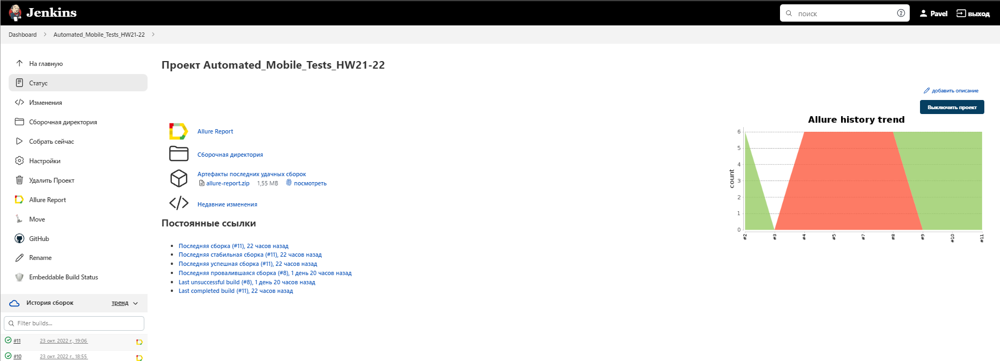
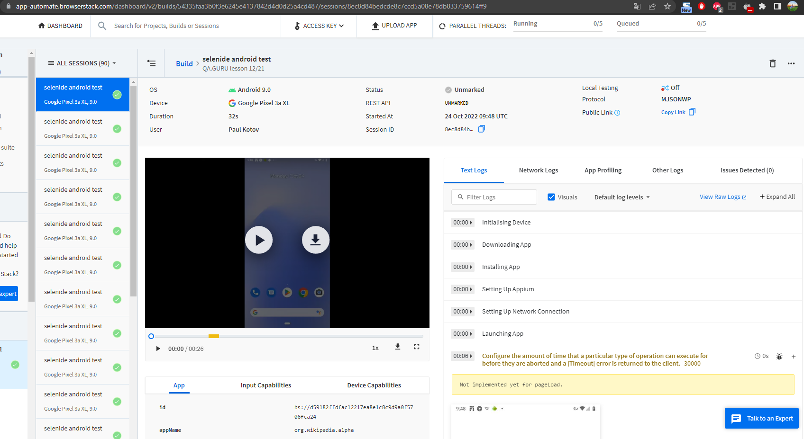
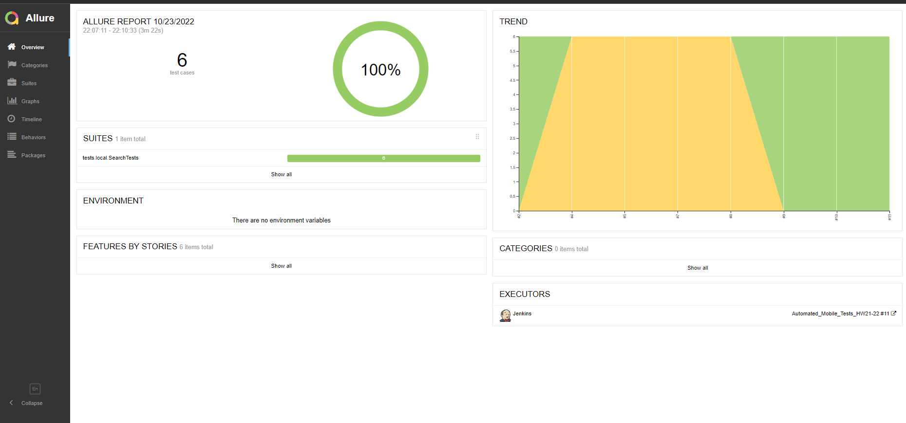
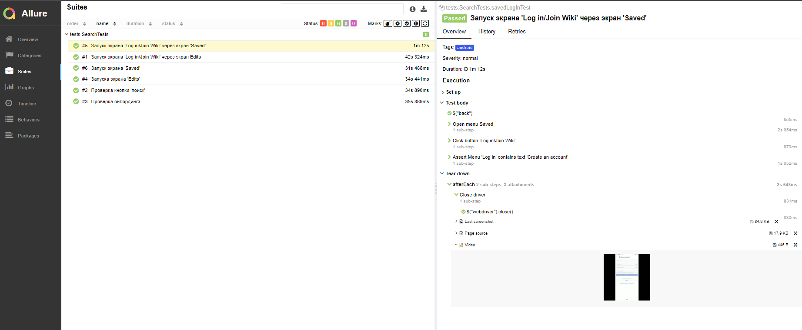
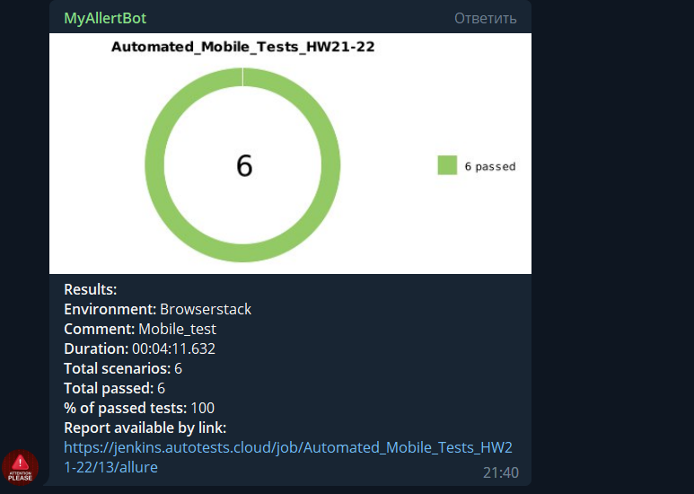
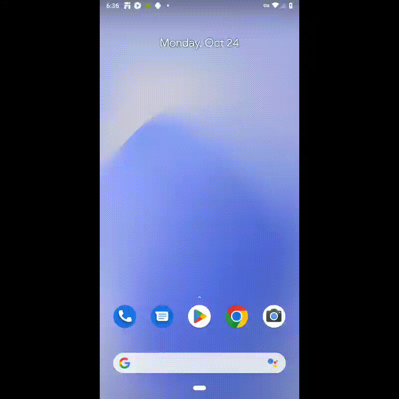

# Проект по автоматизации тестирования android-приложения  "Wikipedia"


<a id="anchor"></a>
 <a target="_blank" href="https://github.com/wikimedia/apps-android-wikipedia/releases">Ссылка на репозиторий приложения</a>

## :page_with_curl: Содержание:

- <a href="#computer-технологии-и-инструменты">Технологии и инструменты</a>
- <a href="#notebook_with_decorative_cover-реализованные-проверки">Реализованные проверки</a>
- <a href="#electric_plug-сборка-в-Jenkins">Сборка в Jenkins</a>
- <a href="#arrow_forward-запуск-из-терминала">Запуск из терминала</a>
- <a href="#👽-отчет-browserstack">Отчет BrowserStack</a>
- <a href="#open_book-allure-отчет">Allure отчет</a>
- <a href="#robot-отчет-в-telegram">Отчет в Telegram</a>
- <a href="#film_projector-видео-пример-прохождения-тестов">Видео пример прохождения тестов</a>

## :computer: Технологии и инструменты

<p align="center">


</p>

## :notebook_with_decorative_cover: Реализованные проверки

- Проверка кнопки 'Search Wikipedia'
- Проверка экрана 'Saved'
- Проверка экрана 'Log in/Join Wiki' через экран 'Saved'
- Проверка экрана 'Edits'
- Проверка экрана 'Log in/Join Wiki' через экран 'Edits'
- Проверка 'Onboarding '

## :electric_plug: Сборка в Jenkins

##### <a target="_blank" href="https://jenkins.autotests.cloud/job/Automated_Mobile_Tests_HW21-22/">Сборка в Jenkins</a>

<p align="center">

</p>  

## :arrow_forward: Запуск из терминала

Локальный запуск:

```
gradle clean android -Dhost=local
```

Запуск в Jenkins:

```
gradle clean android -Dhost=browserstack
```

## :computer: Отчет BrowserStack

<p align="center">

</p>
## :open_book: Allure отчет

- ### Главный экран отчета

<p align="center">

</p>

- ### Страница с проведенными тестами

<p align="center">

</p>

## :robot: Отчет в Telegram

<p align="center">

</p>

Кроме красочной инфографики доступна возможность перейти по ссылке для
просмотра [отчёта](https://jenkins.autotests.cloud/job/Automated_Mobile_Tests_HW21-22/13/allure/)

## :film_projector: Видео пример прохождения тестов

> К каждому тесту в отчете прилагается видео. Одно из таких видео представлено ниже.
<p align="center">
  
</p>

:arrow_up: [Вверх страницы](#anchor)

:new_moon_with_face: <a target="_blank" href="https://t.me/BiLLGradLe">t.me/BiLLGradLe</a>

---

